<h2 align="center">Vara Example app using Acurast integration</h2>

<p align="center">
  <em>
    Deploy your NodeJS app to the Acurast Decentralized Serverless Cloud and submit to a smart contract deployed on Vara
  </em>
</p>

<p align="center">
  <a href="https://twitter.com/Acurast">
    </a>
</p>

This repository contains an example deployment that runs on the _Acurast Decentralized Serverless Cloud_ and submits to a smart contract deployed to [Vara](https://vara.network/), written in [gear](https://gear-tech.io/).

  
To learn more about Acurast please visit the [website](https://acurast.com/) and [documentation](https://docs.acurast.com/).
To learn more about Vara please visit the [website](https://vara.network/).

## How it works

```mermaid
sequenceDiagram
    autonumber
    actor C as Developer
    participant F as Vara with<br>Acurast proxy contract<br>and consumer contract
    participant A as Acurast<br>Parachain
    participant P as Processor
    
    C->>+F: register job
    note over F: Verifies if enough fees were provided<br>to complete all job executions<br>and pre-pay gas to assigned processors.
    F->>+A: Hyperdrive[REGISTER_JOB]
    deactivate F
    note over A: Locks the cACU tokens necessary to pay the job rewards.
    A->>A: external matcher finds best processors
    deactivate A

    P ->>+A: acknowledge_match
    A ->>+F: Hyperdrive[ASSIGN_JOB_PROCESSOR]
    note over F: Stores assigned processors.
    deactivate A
    F-->>P: 💰 prepay gas for first execution
    deactivate F
    
    P->>+F: fulfill
    F->>F: forward fulfillment payload to consumer contract
    F-->>P: 💰 prepay gas for next execution
    deactivate F

    P->>+A: report executions
    P->>A: finalize job
    A ->> +F: Hyperdrive[FINALIZE_JOB]
    F -->> C: 💰 pay back unused funds
    deactivate A
```



## Installation

Choose a node version that is compatible with Acurast Cloud; we use [nvm](https://github.com/nvm-sh/nvm) to switch to different node versions:

```sh
nvm use 18
```

```sh
yarn install
```

If you updated the [idl](./src/vara_proxy.idl)] for the proxy, run this to update the generated client [lib](./src/lib.ts):
```sh
npx sails-js-cli generate ./src/vara_proxy.idl -o src/ --no-project
```

## Usage

Change the code in `src/` as you wish, keeping the fulfillment contract call. This example just submits a text to the _consumer_ smart contract, using the Acurast proxy contract as an intermediary. Details of this contracts (written in [gear](https://gear-tech.io/)):

- **Consumer contract** [source](https://github.com/gear-foundation/dapps/tree/master/contracts/ping)
- **Acurast Proxy contract** [[source](https://github.com/Acurast/acurast-substrate/tree/develop/hyperdrive/vara/vara-proxy) | [idl](./src/vara_proxy.idl)]: receiving the submission over the `fulfill` message (and handling the rest of the acurast integration protocol).


Build and bundle the source files in `src/` to a single JavaScript file in `dist/index.js`: 

```sh
yarn build
```

*NOTE*: you can run `yarn start` to check the bundling succeeded but you will see errors that the `_STD_` global variable is not present since this is only available on Acurast processors.

You can copy the content of `dist/index.js` to the script form field in the [Acurast Console](https://console.acurast.com/).

Alternatively use the [Acurast CLI](https://github.com/Acurast/acurast-cli) to deploy the job:

```sh
acurast deploy
```

It will eventually print the ipfs URL you can enter directly in the [Acurast Console](https://console.acurast.com/).

Some versions of this example app have already been uploaded under these URLS:

- For Acurast Devnet <-> Vara Testnet: [ipfs://QmbLjJumLdmEHtz6ZYQEqnEtW6mkKwDyfDofLVzjH5bG8Y](https://ipfs.io/ipfs/QmbLjJumLdmEHtz6ZYQEqnEtW6mkKwDyfDofLVzjH5bG8Y)
- For Acurast Canary <-> Vara Mainnet: [ipfs://QmbgLPJzwsNHdgyzjhPNCUR8XTgE9RaBmhS8FC6ArPH5rS](https://ipfs.io/ipfs/QmbgLPJzwsNHdgyzjhPNCUR8XTgE9RaBmhS8FC6ArPH5rS)
